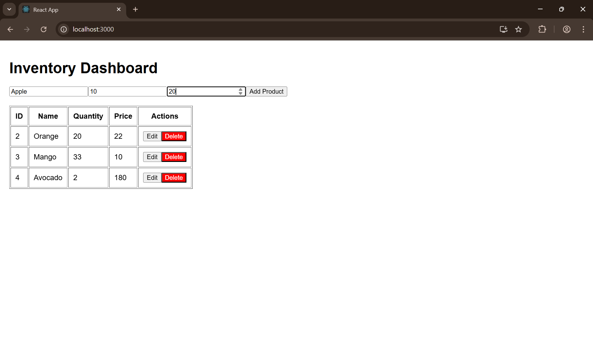

# Inventory Management Dashboard

This is a simple full-stack inventory management system that I built to practice Java (Spring Boot), React, and MySQL integration.  
It allows adding, editing, deleting, and viewing products with live updates.

---

## Features
- Add new products with name, quantity, and price
- Edit product details directly from the list
- Delete products instantly
- See updated data without manually refreshing the page
- Data stored in MySQL for persistence

---

## Tech Stack
**Frontend:** React, Axios, Bootstrap  
**Backend:** Spring Boot (Java), JPA/Hibernate  
**Database:** MySQL  

---

## Screenshots
(All screenshots are saved in the `screenshots` folder)


**Add Product**  


**Edit/Delete Product**  


**Product List**  


---

### How It Works
The React frontend communicates with the Spring Boot backend via REST APIs.
The backend handles all CRUD operations and stores data in MySQL. Any change in the database reflects instantly on the UI.

**Author** :
Swati Kumari

Built as part of my full-stack development learning.
## How to Run Locally

### 1. Clone the repository
```bash
git clone https://github.com/Swatikumarime/inventory-dashboard.git
cd inventory-dashboard


## How to Run
### Backend
```bash
cd Backend
mvnw.cmd spring-boot:run
Backend runs on: http://localhost:8080

### frontend
cd frontend
npm install
npm start
Frontend runs on: http://localhost:3000
